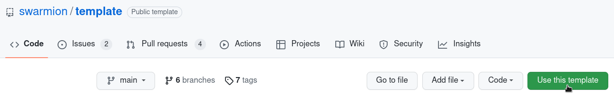

The serverless computing paradigm introduced a lots of opportunities to create more scalable and cost-efficient software, but it also came with its lot of challenges, some of which we harshly experienced.

After more than two years spent building multiple real world applications, ranging from small startups to large groups, we have decided to share our learnings and help other teams build awesome products.

This is why we would like to introduce **Swarmion**, an open-source framework, dedicated to Serverless microservices. A great emphasis has been done on developer experience, since working with a Typescript monorepo is a challenge.

## What is Swarmion? 🐝

Swarmion is an open-source Framework for building Type-safe Serverless microservices at scale. It takes full advantage of the **Serverless Framework** to handle deployment and provisioning of resources, while adding support for microservices and end-to-end type-safety.

It is composed of two parts:

- a **template** for starting state-of-the-art projects
- a set of **tools and plugins**, to ease the communication between microservices and secure their deployment

Today, we are going to focus on the first part, more articles to come...

## TL:DR, create an app using the swarmion template

To create a Swarmion project, head to [https://github.com/swarmion/template](https://www.github.com/swarmion/template).

Click the "use this template" button



And you're all set! Follow the [install docs](https://www.swarmion.dev/docs/getting-started/installation).

## Quick overview

The generated repo will have the following structure.

```
├── backend/
|   ├── core/                       # core service
|   ├── users/                      # users service
|   └── ...                         # other deployed services
|
├── frontend/
|   ├── app/
|   ├── cloudfront/
|   └── ...                         # other deployed services
|
├── commonConfiguration/            # configuration files such as jest, babel...
|   ├── babel.config.js
|   └── lintstaged-base-config.js
|
├── contracts/                      # JSONSchema-based binding contracts.
|   ├── core-contracts/
|   ├── users-contracts/
|   └── ...                         # other contracts, used between deployed services
|
├── packages/
|   ├── configuration/              # common constants used in all services
|   ├── serverless-configuration/   # common constants used in all serverless deployed services
|   ├── serverless-helpers/         # a set of shared helpers
|   └── ...                         # other internal shared packages
|
├── package.json                   # shared dependencies and global scripts
└── yarn.lock                      # unique lock file, using yarn workspaces

```

To learn more about this structure, head to the [documentation](https://www.swarmion.dev/docs/code-structure/monorepo)!

## Our core beliefs

### Your codebase should adapt to your team organization

Changes in the way you organize your teams should not have an impact on the speed at which you can develop and deploy new features. Therefore, Swarmion uses a flexible microservices approach in a monorepo.

### DRY (Don't Repeat Yourself)

Having several teams working in the same environment requires efficient collaboration. Swarmion allows to clearly separate the shared logic and interfaces from the service-specific logic for better decoupling.

### Developer experience is key for code quality

As your codebase grows, testing and deployment times are likely to skyrocket. Swarmion uses optimized low-level software (esbuild, vitejs) to reduce testing and building times and a smart monorepo management tool ([Nx](https://nx.dev/)) to provide a top-level developer experience and reduce CI/CD delays.

## ✨ Template features

The template comes with state of the art tooling for a Typescript monorepo. The main philosophy is to allow easy customization of the different tools used in the packages, without having to write too many code; every tool can be configured at the root level and extended through composition at the package level.

### Yarn 3 with workspaces

Yarn 3 and workspaces allows to create a monorepo with multiple packages, each with their own dependencies. Every package in the monorepo is considered as an npm package inside the monorepo. Every modification to its source code is instantly available to the other packages.

### Nx

A powerful and extensible build system, Nx, is used in the template to manage dependencies between packages, provide visualization of the monorepo dependencies through the [`yarn nx graph` command](https://nx.dev/cli/dep-graph) and gain access to powerful custom generators. Our [nx plugin](https://www.swarmion.dev/docs/code-structure/nx-plugin) already has two generators, for libraries and serverless services (more are coming).

Nx also avoids unnecessary computation when running commands inside the monorepo, using local caching and changes detection for an smooth developer experience and an optimized CI/CD.

### Typescript

Since every package inside the monorepo is using Typescript, every line of code can be statically checked. A strict and strong Typescript configuration is located at the root level, extended throughout the packages using composition.

### ESLint

A comprehensive set of formatting (through [`eslint-plugin-prettier`](https://github.com/prettier/eslint-plugin-prettier)) and linting rules, generated with [Clinter](https://github.com/theodo/clinter). Once again, each package can easily extend the root configuration.

### Shared Typescript libraries

One of the main challenges of build a Typescript monorepo is to build shared Typescript libraries. Packages are transpiled in `cjs`, `esm` (thanks to [Babel](https://babeljs.io/)) and `.d.ts` Typescript declaration file, to enable any usage across the monorepo.

### Jest

Every package has testing configured through [`jest`](https://jestjs.io/), with a default configuration that can easily be extended, thanks to the `jest.config.ts` file at the package level.

### VS Code support

Each package in the monorepo is defined as a workspace in the multi-root workspaces. It enables easier browsing and searching features, bringing the same navigation than in a standard codebase.

Using multi-root workspaces makes it possible to use the great [`vs-code` extension](https://github.com/jest-community/vscode-jest#how-to-use-the-extension-with-monorepo-projects), which makes it possible to run and debug tests directly inside VS Code.

## 🎁 Wrapping up

Be sure to check out https://www.swarmion.dev/ for docs about Swarmion, the [template repo](https://github.com/swarmion/template) and the [tools repo](https://github.com/swarmion/swarmion). Any feedback is greatly welcomed!

### 🎄 Upcoming features

Swarmion is being maintained by a core team of several people, we are striving to deliver more and more features:

- a `create-swarmion-app` script to create an app even more easily
- contracts library to define type-safe and runtime interactions between services
- frontend and frontend library generators

### 🤝 Acknowledgments

Thanks to the swarmion team: [Adrien Cacciaguerra](https://github.com/orgs/swarmion/people/adriencaccia), [François Farge](https://github.com/orgs/swarmion/people/fargito), [Guillaume Duboc](https://github.com/orgs/swarmion/people/guillaumeduboc), [Maxime Vivier](https://github.com/orgs/swarmion/people/MaximeVivier), [Axel Fournier](https://github.com/orgs/swarmion/people/Sc0ra) and [Stanislas Hannebelle](https://github.com/orgs/swarmion/people/StanHannebelle).

Thanks to all the contributors !

Thanks to [Theodo](https://www.theodo.fr/) for sponsoring this project !
