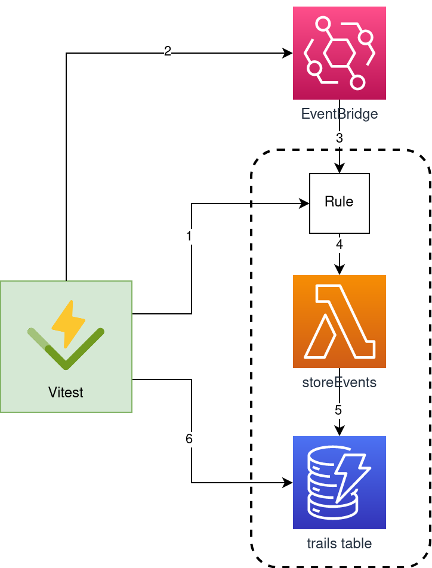

When building event-driven Serverless applications on AWS, EventBridge is a must-have. It's simple to use, scalable and inexpensive.

However, a challenge I often faced during my event-driven projects was testing. I could not find an easy way to validate that the events sent by my application were matching my expectations. The critical challenge was to list events sent through an event bus, which is not natively possible with EventBridge.

## TL;DR

I made a cool EventBridge integration testing library for Typescript, [check it out](https://github.com/fargito/event-scout)!

## What could go wrong in my event-driven architecture?

Since its initial release in 2019, EventBridge has been widely used to build event-driven Architecture on AWS, progressively replacing older tools such as SQS and SNS (although these still have valid specific use cases).

I have always been a fan of EventBridge. It’s simple to use, powerful and inexpensive. However, during my first projects with EventBridge, I found it very difficult to test my asynchronous applications.

For example, let’s imagine a very simple application with EventBridge:


In this architecture, we have two Lambdas, the first one synchronously triggered by ApiGateway. This Lambda then puts an _ORDER_CREATED_ event into EventBridge. That event triggers the execution of a second lambda. Pretty simple, right?

However, we need to be aware of what could go wrong in our application:

- our **application** code can behave unexpectedly and fail to send the event


- there can be **configuration** issues:
  - invalid IAM permissions
  - missing environment variables
  - `onOrderCreated` could listen to the wrong event


To alleviate these potential risks, there are 3 levels at which we can test this application:

- **unit tests**: they can address the **application** failure cause. They validate that the code behaves as expected, and mock its external interactions. Efficient unit testing for Lambda is a complex topic in itself, that I will address in another article on hexagonal architecture for Serverless
- **integration tests**: they take several components of the system and assert that they behave as expected together There are multiple types of integration tests, and in particular [cloud-native integration tests](https://dev.to/kumo/stop-using-a-local-environment-to-develop-serverless-applications-43a3). Fortunately for us, these tests can prevent our **configuration** failure cause
- **end-to-end tests**: they consider our whole system as a black box and only interact with its interface. They are beyond the scope of this article

During the rest of this article, we will focus on **integration tests** and **EventBridge**. In our system, two integration tests would seem relevant.

The simplest one tests the interactions between EventBridge and `onOrderCreated`.


In order to validate that EventBridge and `onOrderCreated` are correctly configured, we can simply put an event matching the correct pattern in EventBridge at the beginning of our test, then wait and check that our lambda has been invoked, for example, by checking CloudWatch logs.

The second integration test is more complex and aims to check the interactions between the resources at the start of our process.


Here, the goal of our integration test is to call the endpoint provided by API Gateway and assert that the `createOrder` Lambda function has sent an event matching our expectations in EventBridge. And this is where it gets truly complicated.

## Events? What events?

Testing event-driven architectures is a whole topic in itself, but in particular, EventBridge doesn’t make it easier.

But what makes EventBridge-powered applications so difficult to test? EventBridge provides no way of listing events that have transited through it, or event check that an event has been put to it. It makes a lot of sense in a production environment, but in order to check that our code has produced some events, it does make our life harder.

In order to assert that events have transited through a bus, we need to project them somehow in an observable place.

## Searching for an EventBridge testing tool

In order to bypass EventBridge limitations on the testing topic, I searched for an existing tool.

But first, I wondered, what would I want from this tool?

- I’d want it to be **simple** to set up. Developers need to encounter the least possible friction to write good integration tests
- I’d want it to be **scalable**: I need my integration tests to be able to run in parallel without interference
- I’d want it to remain **cheap**: my whole architecture uses the serverless pay-as-you-go pricing model, and my tests must remain inexpensive enough
- Obviously, it needs to be **secure** (do I need to explain why?)

In found several solutions online:

- Setting up [a Step Function](https://aws.amazon.com/blogs/compute/testing-amazon-eventbridge-events-using-aws-step-functions/) for each test
- Creating an EventBridge target to dump events to SQS. This approach was proposed in several articles ([here](https://medium.com/serverless-transformation/bridge-integrity-integration-testing-strategy-for-eventbridge-based-serverless-architectures-b73529397251) and [here](https://serverlessfirst.com/eventbridge-testing-guide/)) and implemented in [sls-test-tools](https://github.com/aleios-cloud/sls-test-tools)
- Using CloudWatch to dump and debug events, [introduced by David Boyne](https://www.boyney.io/blog/2021-04-15-debug-eventbridge-events-with-cloudwatch). Although it was not directly aimed at testing, maybe this solution could be used for integration tests

I wanted to evaluate the perks and drawbacks of each solution, so I scored them against my constraints and put them in a comparative table:

|  | Simple setup | Scalable | Cheap | Secure |
| --- | --- | --- | --- | --- |
| **Step functions** | ❌ Manual setup required | ⚠️ Probably one infrastructure per test | ✅ Pay-as-you-go | ✅ IAM |
| **SQS** | ✅ NPM package <br>✅ Automated resources creation | ❌ No parallelism: SQS can only have one consumer <br>⚠️ [SQS creation limits](https://docs.aws.amazon.com/AWSSimpleQueueService/latest/APIReference/API_DeleteQueue.html) | ✅ Pay-as-you-go<br>⚠️ No automatic disabling of resources | ✅ IAM |
| **CloudWatch** | ❌ Manual setup required | ✅ Unlimited parallel reads | ❌ CloudWatch logs are expensive!<br>❌ No automatic rule disabling | ✅ IAM<br>⚠️ Sensible event data may persist in the logs |

Although all of these solutions inspired me and made me realize that testing EventBridge was possible, it seemed none of them completely fulfilled my requirements.

## Building a scalable EventBridge testing infrastructure

Having considered that existing tools would not fill my requirements, I decided to build and open-source a solution.

Obviously, I kept the same requirements I had applied to existing online solutions.

### Simple to use

EventScout is composed of two highly reusable parts

- A CDK construct to deploy the necessary resources
- A lightweight client to use in the tests, for example with Jest of Vitest


If you wish to learn how to use EventScout on you project, head to [the documentation](https://github.com/fargito/event-scout).

### **Scalable**

Making our testing infrastructure scalable requires that our tests can be run in parallel. For this:

- We must not be constrained by AWS quotas (e.g. after an SQS queue is deleted, another with the same name [cannot be created for 60 seconds](https://docs.aws.amazon.com/AWSSimpleQueueService/latest/APIReference/API_DeleteQueue.html)). Therefore EventScout ensures only the minimal resources are created **during** a test suite, and reuse resources between tests
- We must be able to receive events independently for each test suite:
  - Each test suite declares a pattern of events to watch (a **trail** of events)
  - Each trail is then completely independent from all other trails to allow parallel query. Each trail can be queried as many times as necessary

Therefore, a test suite’s sequence diagram looks like the following:


From an architectural point of view, let’s dive in this sequence:



1. During its setup phase, the test creates an **EventBridge** rule with the desired pattern, linking to EventScout’s ingestion lambda (`storeEvents`)
2. The test produces some events that match the pattern
3. The newly created rule is called
4. The rule triggers the ingestion lambda
5. Using metadata information from the rule, `storeEvents` saves the event in the correct trail.
6. The test can query the trail and perform assertions
7. A the end of the test, the only thing left is to delete the EventBridge rule

Two features are key here to make EventScout scalable:

- Using one EventBridge rule per test suite:
  - it makes each test fully independent from all others
  - it reuses infrastructure and only needs to create and delete the rule, which is quite fast
- Using the rule metadata to store events in a trail:
  - there is no need for additional request or computation to know which test suites are interested in the received event
  - if an event matching two rules is sent, it will be stored in two trails, which enables parallel tests

### Cheap

EventScout only uses serverless resources (Lambda, DynamoDB, API Gateway) to take full advantage of the pay-as-you-go model. Moreover, EventScout ensures that no unnecessary resources are used through **automatic trail cleanup**. Leveraging DynamoDB’s time-to-live capabilities, it automatically:

- cleans recorded trail events after 15 minutes
- stops the event rules after 15 minutes to handle the case when they haven’t been manually stopped

This makes EventScout the safest way to run integration tests without worrying about their cost.

### Secure

- All interactions between the EventScout client and the construct are secured by IAM
- Events are automatically cleaned after 15 minutes, removing any privacy issue

## Use EventScout on your infrastructure

Leveraging EventScout capabilities on your infrastructure is pretty straightforward.

### Deploy resources with EventScout construct

Start by installing the EventScout construct:

```bash
npm install @event-scout/construct
```

Then, instantiate the CDK construct in your CDK app:

```tsx
import { EventScout } from '@event-scout/construct';
import { CfnOutput } from 'aws-cdk-lib';
import { EventBus } from 'aws-cdk-lib/aws-events';

// create the necessary resources
const { restEndpoint } = new EventScout(this, 'EventScout', {
  eventBus: EventBus.fromEventBusName(this, 'EventBus', eventBusName),
});

// export the endpoint value for easier use in tests
new CfnOutput(this, 'EventScoutEndpoint', {
  value: restEndpoint,
  description: 'EventScout endpoint',
  exportName: '<your export name>',
});
```

The export here is not required, but will be useful to retrieve the EventScout endpoint for your tests.

### Use the EventScout client in your tests

```bash
npm install --save-dev @event-scout/client
```

Then you can head to [the documentation](https://github.com/fargito/event-scout/blob/main/packages/client/README.md) for details on how to instantiate and use the client in your tests.

Congratulations, you have unlocked the power of EventScout! Use it wisely...
